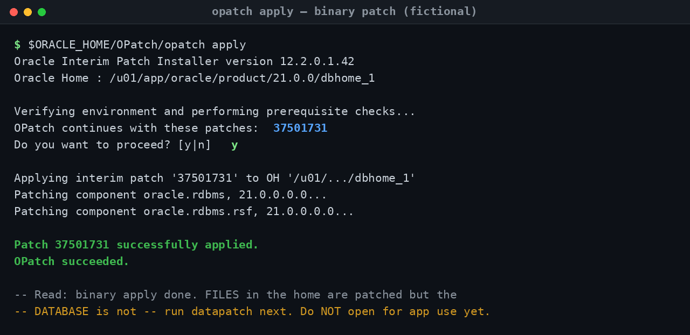
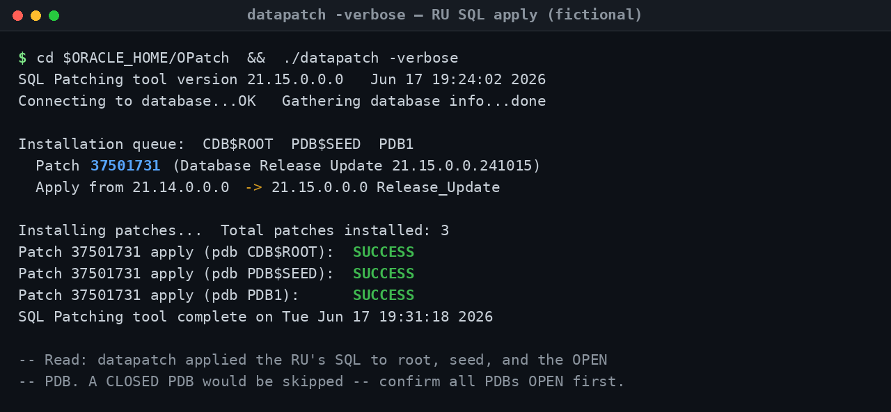
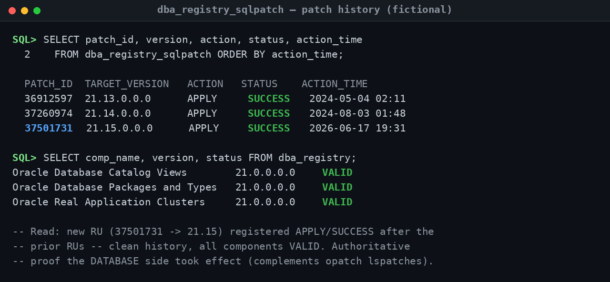
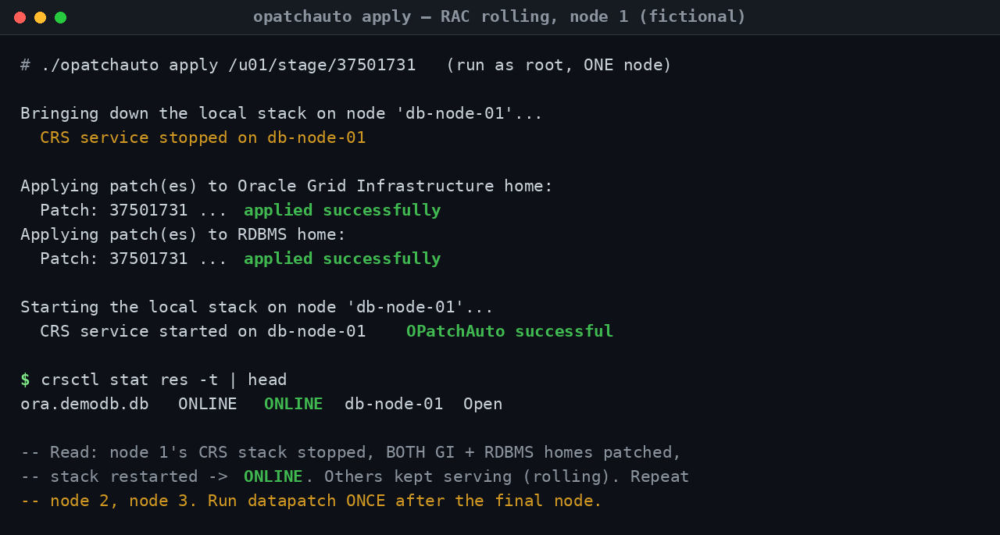
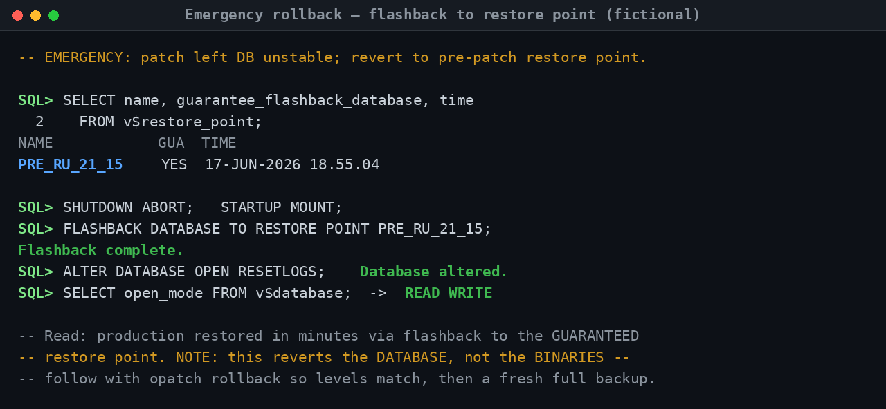

## Operational Screenshots (Proof of Work)

Patching is where databases most often break — and recovery is the skill interview panels probe hardest. This section shows the runbooks in this repository actually executing against a sanitized demo database (`ORADEMO`, node `db-node-01`): the binary apply, the database apply, the registration that proves it took, the rolling RAC variant, and the emergency rollback that restores production when a patch goes wrong. Every patch ID, path, and node name is fictional.

The thread running through all five is the discipline that separates a clean maintenance window from a 3am outage: **the binary and the dictionary are two separate things, and you patch — and prove — both.** A junior DBA runs `opatch apply` and opens the database. A principal DBA knows that's only half the job, validates with evidence, and has a rehearsed way back.

---

### 1 · The binary apply — and knowing it's only half the job (`opatch apply`)

**Problem demonstrated.** Applying a quarterly Release Update to the Oracle home. `opatch` patches the *files* in `$ORACLE_HOME` — the binaries — after prerequisite and conflict checks pass.

**What an experienced DBA concludes.** The apply is clean: prerequisites passed, the patch went onto the home, and OPatch reports success. But the experienced read is in the caveat, not the success line — at this point the **files are patched and the database is not.** Opening the database for application use now, before `datapatch` runs, is exactly the mistake that leaves the binary and dictionary at mismatched levels. The runbook stops you here on purpose.

**Troubleshooting takeaway.** "OPatch succeeded" is a checkpoint, not a finish line. Confirm the OPatch version meets the RU minimum *before* you start (a too-old OPatch is the most common pre-check failure), and never open the database for users between `opatch apply` and `datapatch`.

---

### 2 · The database apply — the step juniors forget (`datapatch -verbose`)

**Problem demonstrated.** The other half of the patch: applying the RU's SQL and dictionary changes to the database itself. In a multitenant database, that has to happen in every container.

**What an experienced DBA concludes.** `datapatch` moved `CDB$ROOT`, `PDB$SEED`, and `PDB1` from 21.14 to 21.15, each reporting `SUCCESS` — so the dictionary now matches the freshly patched binaries. The detail that signals real multitenant experience is what *isn't* on screen: `datapatch` only processes **OPEN** PDBs. A PDB left `MOUNTED` would be silently skipped and would later fail or behave inconsistently — so confirming every PDB is OPEN before running is part of the procedure, not an afterthought.

**Troubleshooting takeaway.** The binary-vs-SQL two-step (`opatch` then `datapatch`) is the single most common thing junior DBAs miss. In a CDB, open all PDBs before `datapatch` — and if you patched RAC, run `datapatch` **once** after the final node, not on every node.

---

### 3 · Proving the patch registered (`dba_registry_sqlpatch`)

**Problem demonstrated.** Validation with evidence. "It seemed to work" is not sign-off; a senior DBA closes the window by proving, from the data dictionary, that the patch is registered and the database is consistent.

**What an experienced DBA concludes.** The history is clean and complete: RU `37501731` (→ 21.15) sits in `dba_registry_sqlpatch` as `APPLY` / `SUCCESS`, in correct sequence after the prior quarterly RUs, and every `dba_registry` component is `VALID`. This is the authoritative database-side confirmation that pairs with `opatch lspatches` on the binary side — together they prove both halves match. This is what you attach to the change record for sign-off.

**Troubleshooting takeaway.** Validate from two sources: `opatch lspatches` proves the binary level, `dba_registry_sqlpatch` proves the SQL level — they must agree. A `WITH ERRORS` status here, or a component that isn't `VALID`, means the patch isn't really done no matter what the apply logs said.

---

### 4 · Rolling a cluster with no outage (`opatchauto` on RAC)

**Problem demonstrated.** Patching a RAC cluster without taking the service down. The payoff of RAC is that a Release Update can be applied node by node while the application keeps running on the surviving nodes.

**What an experienced DBA concludes.** `opatchauto` did the full sequence on node 1: stopped the local CRS stack, patched **both** the Grid Infrastructure and RDBMS homes in one pass, and restarted the stack — and the `crsctl stat res -t` check confirms the node is back `ONLINE` before anyone moves on. The other nodes served traffic throughout. The discipline shown is the verify-before-proceed gate: you confirm node 1 rejoined cleanly *before* touching node 2, so a half-patched cluster never goes unnoticed.

**Troubleshooting takeaway.** In rolling RAC patching, verify each node is fully `ONLINE` before starting the next — proceeding on faith is how you end up with a split, half-patched cluster. And run `datapatch` exactly once, after the last node rejoins; the binaries roll node-by-node, but the dictionary is patched a single time.

---

### 5 · Recovery confidence — the rehearsed way back (emergency flashback rollback)

**Problem demonstrated.** The scenario every patch plan must answer before it starts: the patch destabilized production, and service has to come back *now*. This is the rehearsed rollback that makes patching safe to attempt at all.

**What an experienced DBA concludes.** Because a **guaranteed restore point** (`PRE_RU_21_15`) was taken before patching, the whole database can be flashed back in minutes — `SHUTDOWN ABORT`, `STARTUP MOUNT`, `FLASHBACK DATABASE TO RESTORE POINT`, `OPEN RESETLOGS`, back to `READ WRITE`. The principal-level detail is the closing note: flashback reverts the **database, not the binaries.** If the 21.15 patch is still in the home, you must follow with `opatch rollback` so binary and dictionary levels match again, then take a fresh full backup. Restore service first; reconcile the levels second.

**Troubleshooting takeaway.** A guaranteed restore point taken in the pre-patch checklist is what turns a catastrophic patch into a minutes-long rollback — never patch without one. And remember flashback only moves the database: reconcile the binaries afterward, or you've traded an outage for a silent version mismatch.

---

> **All screenshots are fully sanitized and fictional.** `ORADEMO`, node `db-node-01`, paths like `/u01/app/oracle/...`, restore point `PRE_RU_21_15`, and patch IDs such as `37501731` are illustrative placeholders created for this portfolio — patch numbers show the format only and no production, employer, or confidential information is shown. Each capture mirrors the annotated output in [`sample_outputs/`](sample_outputs/), where every example ends with a **"Read:"** note explaining what the output proves and what to do next.
